# Emotion Analysis

​	整理一下目前为止写过的实验模型的代码，包括我们的论文以及复现的一些论文，主要任务包括情绪原因识别、情绪分类、情绪词典构建。

##  1 Source code tree

~~~
.
├── README.md
├── Cause
│   ├── ABSC
│   	├── AE_BiLSTM_dis0_emo.py	paper1
│   	├── AT_BiLSTM_dis0_emo.py	paper1
│   	├── ATAE_LSTM_dis0_emo.py	paper1
│   	├── ATAE_BiLSTM_dis0_emo.py	paper1
│   	├── EATT_BiLSTM_dis0_emo.py
│   ├── BiLSTM_ATT.py	最简单的文本分类
│   ├── BiLSTM_ATT_dis.py	dis以词嵌入的方式拼接在每个cause中
│   ├── BiLSTM_ATT_dis_one-hot.py	隐层拼接dis的one-hot表示
│   ├── LogisticRegression.py	dis信息 + LR
├── Classification
│   ├── multi_label
│   	├── BRNN
│   		├── Bi-LSTM-Att-BR2.py	paper2
│   	├── TDNN
│   		├── paper3
│   			├── Emotion_CNN.py paper3 复现的第一个multi_label模型
│   			├── Emotion_CNN_prob.py 去掉paper3中的多标签转换成单标签的步骤，直接利用CNN模型学习，threshold = 0.15
│   			├── Emotion_GRU.py 利用GRU进行多标签学习，threshold = 0.15
│   			├── LSTM.py 利用LSTM进行多标签学习，threshold=0.15
│   			├── Bi-LSTM.py 利用BiLSTM进行多标签学习，threshold=0.15
│   			├── Evalue.py 内含Calibrated Label Ranking方法以及多标签评估方法
│   			├── Emotion_GRU_attention.py GRU + Attention + Calibrated 
│   			├── Emotion_CNN_GRU_att.py CNN卷积之后不做max_pooling，直接送到GRU中
│   			├── Emotion_GRU_att_add_emotion_relation_wheel.py 在损失函数中加入先验的情绪轮约束
│   			├── Emotion_GRU_add_emotion_relation_coef.py 各个类别之间的情绪约束由皮尔森相关系数得到。
│   		├── Bi-LSTM-Att-Threshold.py threshold=1.0/9
│   		├── Bi-LSTM-Attention-calibrated.py paper2中的TDNN选用的这个model
│   	├── JBNN(Our method)
│   		├── Bi-LSTM_ATT_9b.py paper2
│   		├── Bi-LSTM_ATT_Topic_9b 
│   			├── Bi-LSTM_ATT_Topic_9b.py 在JBNN模型的隐层拼接传统特征
│   			├── get_dic_feature.py 词典特征
│   			├── process_topic_feature.py 话题特征，话题特征由Biterm Topic model得到
│   			├── For_tra_feature.py CHI选择特征，TF-IDF表示
│   ├── multi_class
│   	├── Rule 统计文本中关于情绪类别j的情绪词个数
│   	├── Traditional machine learning 
│   		├── SVM 单词特征、标点符号特征、情绪词典特征
│   		├── NB+SVM paper8 NB包括多项式模型和伯努利模型
│   		├── NB+KNN paper8 先用NB识别有无情绪（情绪判别），再做情绪分类任务。
│   	├── Neural network
│   		├── 1NN_.py paper4 输入文档的词频v,通过f=sigmoid(wv+b)得到预测的话题分布，利用softmax(f)得到情绪标签。
│   		├── HN_BiLSTM_ATT.py paper5 层次注意力模型，文档级文本分类
│   	├── Rule_joint_ML paper9 
├── Lexicon
│   	├── Seco_Prec_Npmi1.py paper6 利用共现关系(NPMI)计算候选词与情感种子词之间关系，这里情感种子词通过DUTIR情绪词典得到
│   	├── smile_dic paper7 互信息法计算两种表情的关联程度
│   	├── chi_dic paper8 通过卡方计算一个词t与一个类别c的相关性
~~~

## 2 Related papers

[1]  Wang Y, Huang M, Zhao L. Attention-based lstm for aspect-level sentiment classification[C]//Proceedings of the 2016 Conference on Empirical Methods in Natural Language Processing. 2016: 606-615.

[2] **He H, Xia R. Joint Binary Neural Network for Multi-label Learning with Applications to Emotion Classification[J]. arXiv preprint arXiv:1802.00891, 2018. (Our Paper)**

[3] Wang Y, Feng S, Wang D, et al. Multi-label Chinese microblog emotion classification via convolutional neural network[C]//Asia-Pacific Web Conference. Springer, Cham, 2016: 567-580.

[4] Li X, Rao Y, Xie H, et al. Bootstrapping Social Emotion Classification with Semantically Rich Hybrid Neural Networks[J]. IEEE Transactions on Affective Computing, 2017, 8(4): 428-442.

[5] Yang Z, Yang D, Dyer C, et al. Hierarchical attention networks for document classification[C]//Proceedings of the 2016 Conference of the North American Chapter of the Association for Computational Linguistics: Human Language Technologies. 2016: 1480-1489.

[6] Agrawal A, An A. Selective Co-occurrences for Word-Emotion Association[C]//Proceedings of COLING 2016, the 26th International Conference on Computational Linguistics: Technical Papers. 2016: 1579-1590.

[7] 潘明慧. 基于词典的中文微博情绪分析[D]. 南京: 南京航空航天大学计算机科学研究生学院, 2014.

[8] 欧阳纯萍, 阳小华, 雷龙艳, 等. 多策略中文微博细粒度情绪分析研究[J]. 北京大学学报 (自然科学版), 2014, 50(1): 67-72.

[9] Wen S, Wan X. Emotion classification in microblog texts using class sequential
rules[C].Twenty-Eighth AAAI Conference on Artificial Intelligence. 2014.	

## 3 Cause

### 3.1 Model

**(1) AE**

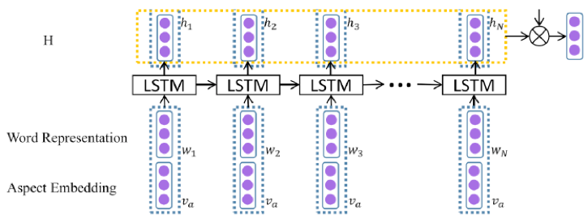

**(2) AT**

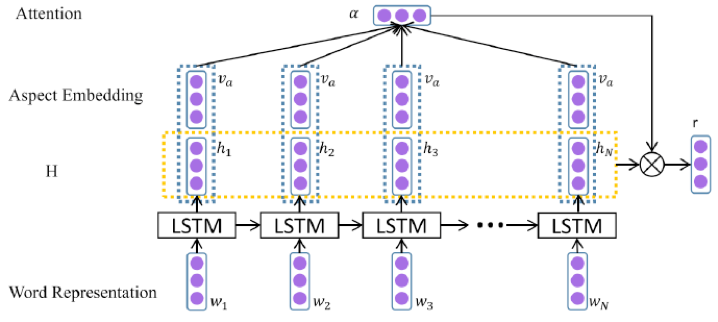

**(3) ATAE**

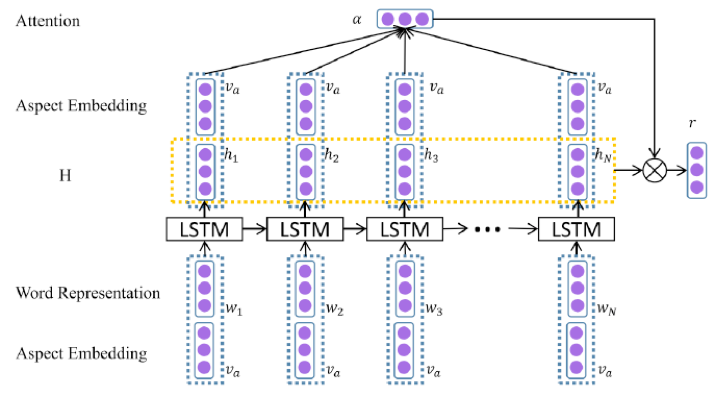

**(4) EATT**

​	EATT也是别人的方法，该模型在ATAE的基础上做了一些变动。

​	ATAE中，模型利用隐藏层h拼接目标词向量（target）学习attention。

​	EATT中，将隐藏层与目标词向量拼接得到v，将输入层与目标词向量拼接的结果记为e，将v与e逐元素相乘的结果记为new_target，最后利用隐藏层h拼接new_target学习attention。

## 4 Classification

### 4.1 Multi_label

**(1) BRNN&TDNN&JBNN**

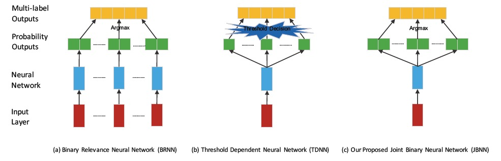

现在用于multi-label的神经网络的方法可以分为BRNN、TDNN两种，其中TDNN方法更多。JBNN模型是我们提出的方法，如图：

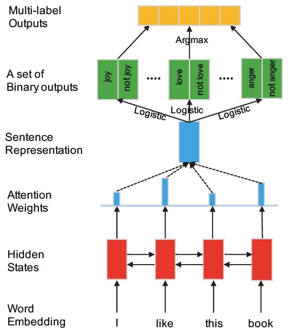

**(2) paper 3**

论文[3]是我复现的第一个multi-label模型，它属于TDNN模型，该方法包括以下三个部分。

a) 数据集转换

将多标签转换成单标签。

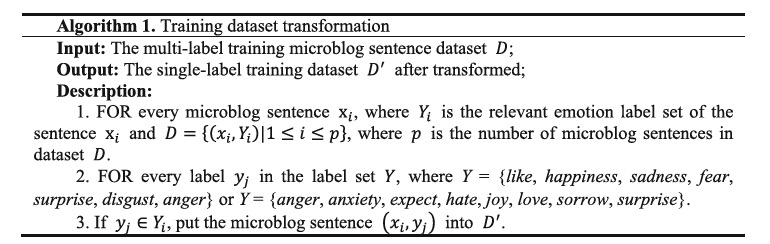

b) CNN model

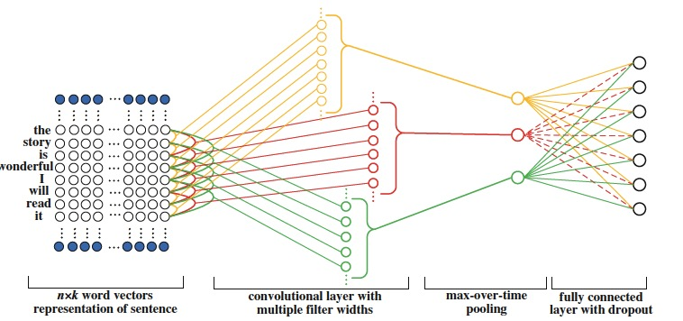

c) Calibrated Label Ranking

这一步主要是为了将prob结果转换成multi-label结果。

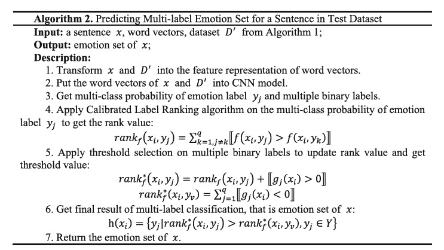

复现完论文[3]之后，我做了一些尝试，包括

~~~
Emotion_CNN_prob.py 不再将train中的多标签句子转成单标签，而是直接输入多标签的pro信息，threshold=0.15
Emotion_GRU.py 利用GRU进行多标签学习，threshold=0.15
LSTM.py 利用LSTM进行多标签学习，threshold=0.15
Bi-LSTM.py 利用BiLSTM进行多标签学习，threshold=0.15
Evalue.py 内含Calibrated Label Ranking方法以及多标签评估方法
Emotion_GRU_attention.py 前面尝试各种基础模型(CNN、LSTM、BiLSTM、GRU)之后，发现GRU的效果最好，于是在GRU的基础上加了attention，用Calibrated Label Ranking得到multi-label的结果。（多标签转单标签+GRU+calibrated）
Emotion_CNN_GRU_att.py 在6的基础上，进一步尝试CNN-GRU-static-Attention，CNN卷积之后不做max_pooling，直接送到GRU中
Emotion_GRU_att_add_emotion_relation_wheel.py 在6的基础上，在损失函数中加入先验的情绪轮约束
Emotion_GRU_add_emotion_relation_coef.py 各个类别之间的情绪约束由皮尔森相关系数得到。当stats.pearsonr(y_emo_train[:, i], y_emo_train[:, j])[0]>0，omiga[i][j] = 1，其他情况值为-1。
~~~

**(3) TDNN**

为了方便比较，BRNN、TDNN、JBNN的神经网络部分选择相同，都是BiLSTM+attention。

~~~
Bi-LSTM-Att-Threshold.py threshold=1.0/9
Bi-LSTM-Attention-calibrated.py paper2中的TDNN选用的这个model
~~~

**(4) JBNN**

~~~
Bi-LSTM_ATT_9b.py paper2
Bi-LSTM_ATT_Topic_9b.py 在JBNN模型的隐层拼接传统特征

传统特征：
1）get_dic_feature.py 词典特征，文本表示包括三部分[the number of words in the tweet matching each class are counted, the individual scores for each class are summed, 每个情绪类别是否有情感词]						
2）process_topic_feature.py 话题特征，话题特征由Biterm Topic model得到，https://github.com/xiaohuiyan/BTM
3）For_tra_feature.py CHI选择特征，TF-IDF表示
~~~

### 4.2 Multi_class

#### 4.2.1 Rule

基于规则的情绪分类方法：

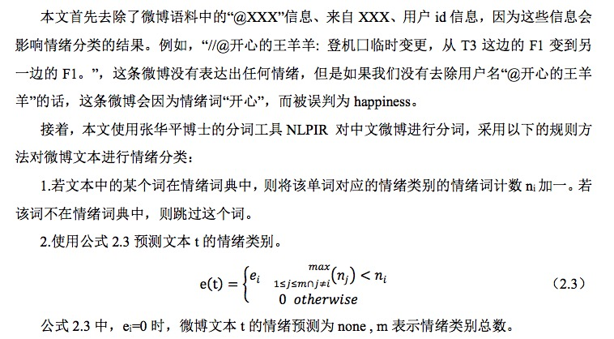

#### 4.2.2 Traditional machine learning

##### 4.2.2.1 SVM

##### 4.2.2.2 NB+SVM and NB+KNN

**(1) 特征选择**

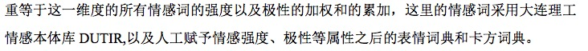

**(2) 朴素贝叶斯**

​	包括多项式模型和伯努利模型。

**(3) KNN**

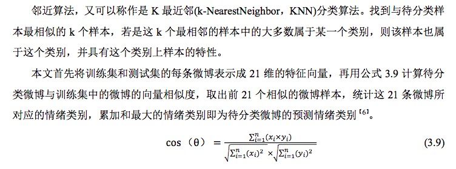

#### 4.2.3 Neural network

HN_BiLSTM_ATT.py paper5 层次注意力模型，文档级文本分类

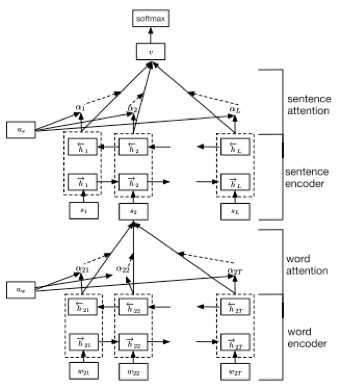

#### 4.2.4 Rule_joint_ML

​	先采取规则方法获得句子级的结果，接着将每一条微博表示为句子级情绪的序列，然后从训练集中挖掘类别序列规则(Class Sequential Rule, CSR)，从挖掘出的规则中提取新的特征，最后使用SVM获得微博级别的分类结果。

## 5 Lexicon

###  5.1 Seco_Prec_Npmi1

Paper6 对于词语w(cue words, 一般为名词、形容词、动词、副词)与情绪种子词z的共现关系进行了改进，提出Selective Co-occurrences。作者认为，在一个窗口内，词语w只与一个seed word共现。

**（1）Selective Co-occurrences**

​	例1为一个窗口内的文本，对于词语（cue word）“party”、两个情绪类别的种子词“angry” 和 “happy”，在传统的共现方法中， “party” 既与“angry” 共现，又与“happy”共现。应用Selective Co-occurrences后， “party” 与“angry” 共现，或者与“happy”共现，而不是与两者都共现。

> 例1 Theater critic Michael Riedel (playing himself) also shows up, uninvited. Ivy is put out by this and gets **angry** at Michael about it. We hear but don't see Ivy singing "Bittersweet  Symphony" at her **party**. Derek then walks in and gives her a present and wishes her **happy** birthday.

- preceding (SECO-PREC): cue word（提示词、候选词）选择**前面的最近的**种子词。例如，与“party”最近的前面的种子词为“angry”，忽略“happy” 。

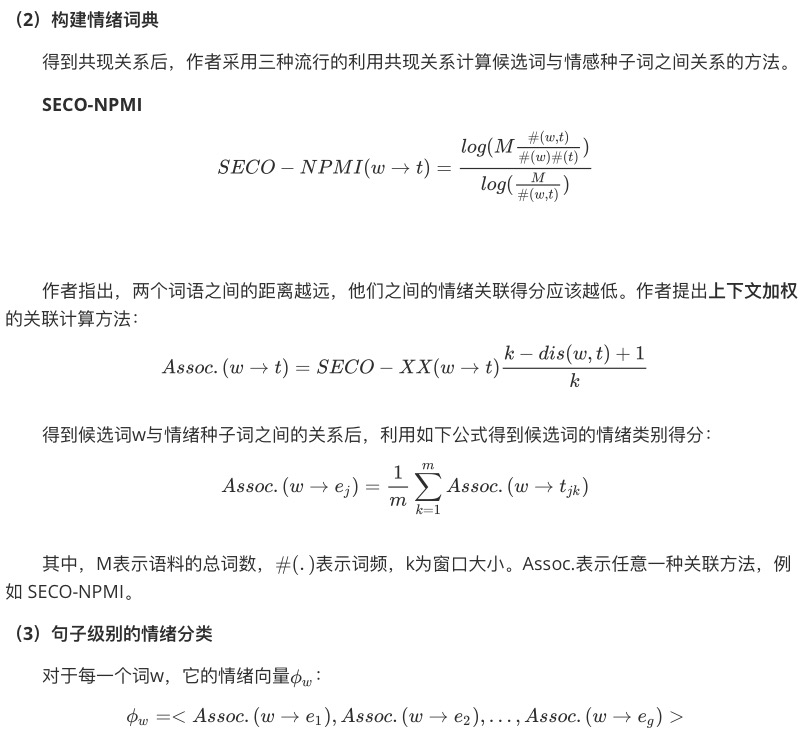

​	

###  5.2 smile_dic

表情词典构建步骤如下：

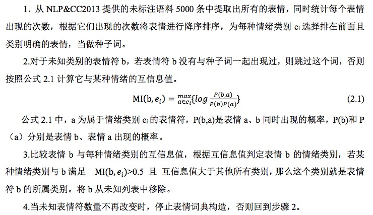

### 5.2 chi_dic

卡方词典构建步骤如下:

​			
​		
​	

